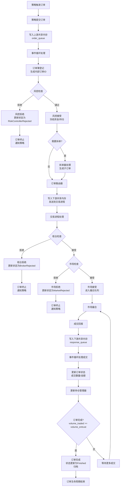
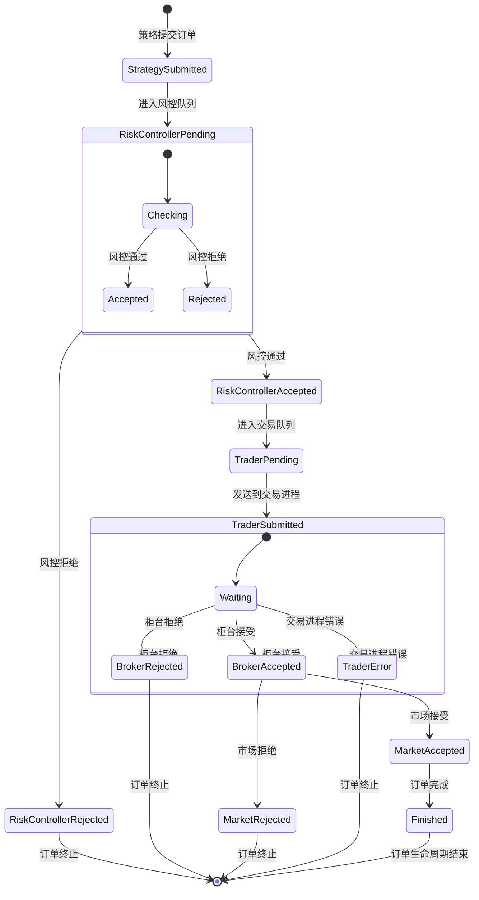
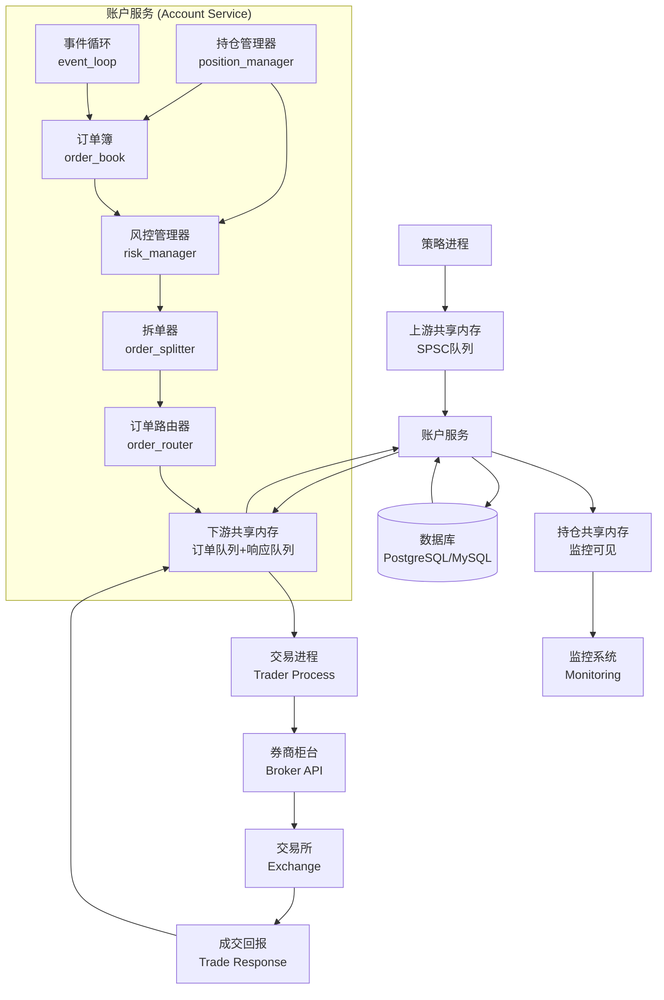
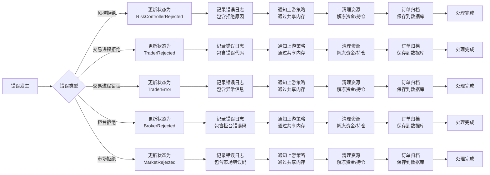

# 订单处理流程图

本文档展示量化交易账户服务中订单的完整生命周期流程图。系统是一个高性能低延时的订单处理服务，负责接收策略订单、进行风控检查、拆单、路由到交易进程，并处理成交回报。

## 系统概述

账户服务接收上游策略用户发出到共享内存中的订单，读取后将其按需经过风控模块的验证，然后拆单或直接发送订单到下游的交易进程的共享内存中。需要负责维护上游订单状态，更新该订单在共享内存中的状态。

### 主要模块
- **订单簿 (order_book)**：管理活跃订单，生成内部订单ID
- **风控管理器 (risk_manager)**：多维度风险控制检查
- **拆单器 (order_splitter)**：根据配置执行拆单策略
- **订单路由器 (order_router)**：将订单发送到下游交易进程
- **持仓管理器 (position_manager)**：管理账户资金和持仓
- **事件循环 (event_loop)**：主处理循环，协调各模块工作

## 1. 主流程图：订单完整生命周期



### 流程说明
1. **订单接收**：策略通过上游共享内存SPSC队列发送订单
2. **风控检查**：多层次风控规则检查，包括资金、持仓、价格限制等
3. **资金/持仓冻结**：风控通过后冻结相应资金或持仓
4. **拆单处理**：根据配置决定是否拆单（固定大小、冰山、TWAP、VWAP等策略）
5. **路由发送**：通过下游共享内存发送到交易进程
6. **交易处理**：交易进程与券商柜台交互，提交订单到交易所
7. **成交回报**：处理市场成交回报，更新订单状态和成交信息
8. **持仓更新**：根据成交结果更新账户持仓和资金
9. **订单完成**：订单全部成交后归档，生命周期结束

## 2. 状态转换图：订单状态机



### 状态说明
| 状态 | 枚举值 | 说明 |
|------|--------|------|
| `StrategySubmitted` | 0x12 | 策略已提交订单 |
| `RiskControllerPending` | 0x20 | 风控待处理 |
| `RiskControllerRejected` | 0x21 | 风控拒绝 |
| `RiskControllerAccepted` | 0x22 | 风控通过 |
| `TraderPending` | 0x30 | 交易进程待处理 |
| `TraderRejected` | 0x31 | 交易进程拒绝 |
| `TraderSubmitted` | 0x32 | 交易进程已提交 |
| `TraderError` | 0x33 | 交易进程错误 |
| `BrokerRejected` | 0x41 | 柜台拒绝 |
| `BrokerAccepted` | 0x42 | 柜台接受 |
| `MarketRejected` | 0x51 | 市场拒绝 |
| `MarketAccepted` | 0x52 | 市场接受 |
| `Finished` | 0x62 | 订单完成 |

**风控拒绝原因**：资金不足、持仓不足、超过单笔限额、超过日限额、价格超出范围、证券不允许、账户冻结、重复订单等。

**市场接受后**：订单进入交易所撮合队列，等待成交回报，可能部分成交或全部成交。

## 3. 组件交互图：系统架构



### 架构说明
- **上游通信**：策略进程通过共享内存SPSC队列发送订单，实现低延迟通信
- **内部处理**：事件循环协调各模块，订单依次经过订单簿、风控、拆单器、路由器
- **下游通信**：通过共享内存将订单发送到交易进程，并接收成交回报
- **外部集成**：与券商柜台、交易所交互，支持数据库持久化和监控系统

## 4. 错误处理流程图



### 错误处理策略
1. **错误分类**：根据错误来源分类（风控、交易进程、柜台、市场）
2. **状态更新**：更新订单状态为相应的拒绝状态
3. **日志记录**：详细记录错误原因、错误码和上下文信息
4. **策略通知**：通过共享内存通知上游策略进程
5. **资源清理**：解冻已冻结的资金或持仓
6. **订单归档**：将订单保存到数据库供后续分析

## 关键数据结构

### 订单请求 (`order_request`)
- 192字节大小，3个缓存行对齐（64字节对齐）
- 包含完整订单信息：ID、类型、方向、市场、价格、数量等
- 原子状态字段，支持多线程安全访问
- 定义在 [include/order/order_request.hpp](../include/order/order_request.hpp)

### 共享内存布局 (`shm_layout`)
- **上游共享内存**：策略→账户服务（订单队列）
- **下游共享内存**：账户服务→交易进程（订单队列+响应队列）
- **持仓共享内存**：持仓信息（可被外部监控读取）
- 定义在 [include/shm/shm_layout.hpp](../include/shm/shm_layout.hpp)

## 性能特性

1. **低延迟设计**：
   - 共享内存SPSC队列通信
   - 缓存行对齐数据结构
   - 原子操作和无锁设计

2. **高吞吐量**：
   - 批量订单处理支持
   - 高效的事件循环
   - 并行风控检查

3. **系统容量**：
   - 最大活跃订单数：65,536
   - 最大持仓数量：8,192
   - 队列容量：4,096-8,192

## 使用说明

### 查看流程图
1. **在线查看**：在支持Mermaid的Markdown查看器（如GitHub、GitLab、VS Code等）中打开本文件
2. **生成图片**：使用Mermaid CLI生成PNG/SVG图片：
   ```bash
   npm install -g @mermaid-js/mermaid-cli
   mmdc -i docs/order_flowchart.mmd -o docs/images/order_flow.png
   ```

### 源码位置
- Mermaid源代码：`docs/order_flowchart.mmd`
- Markdown文档：`docs/order_flowchart.md`
- 相关代码：`include/` 目录下的各个头文件

## 维护说明

1. **保持同步**：当订单处理逻辑变更时，需要同步更新流程图
2. **状态枚举**：确保状态转换图与 `order_status_t` 枚举保持一致
3. **组件接口**：组件交互图应反映实际的模块依赖关系
4. **错误处理**：错误处理流程图需涵盖所有可能的错误路径

---

*最后更新：2026-02-02*
*基于代码版本：41f0205*