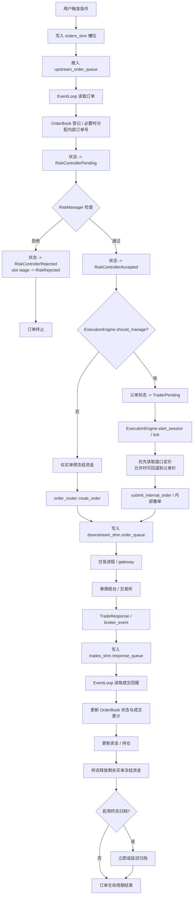
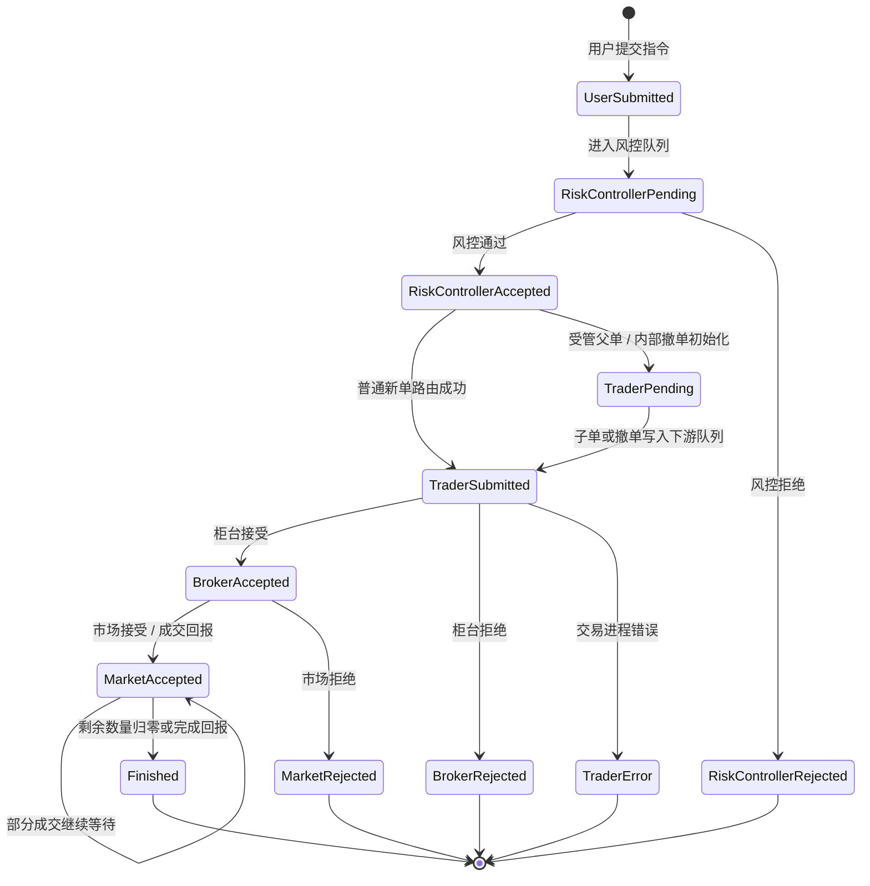
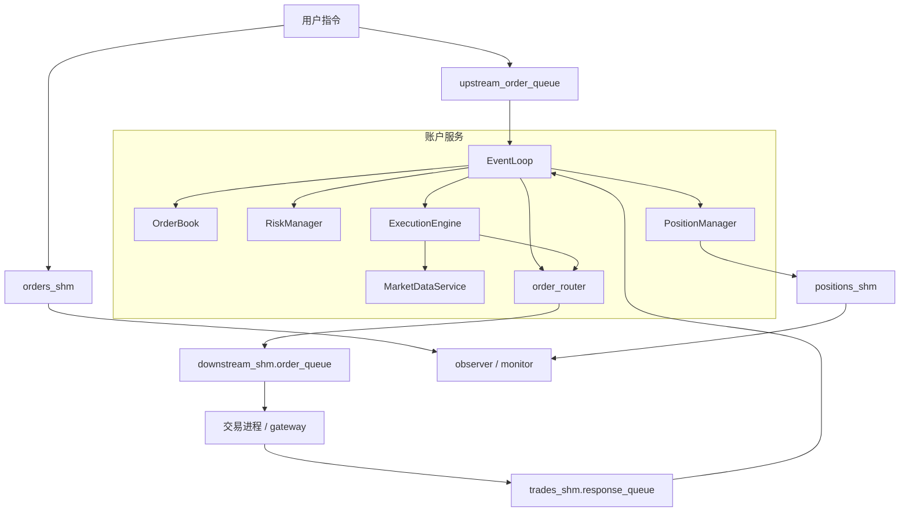

# 订单处理流程图

本文档展示账户服务当前实现下的订单生命周期。重点是把主链路、状态转换和组件分工与 `src/core/event_loop.cpp`、`src/order/order_router.cpp`、`src/execution/execution_engine.cpp` 的现状对齐。

## 系统概述

账户服务从共享内存读取用户提交指令对应的订单索引，统一由 `EventLoop` 编排风控、执行引擎、订单路由和成交回报处理。普通订单与 managed execution 父单共用同一条订单镜像和回报链路，但进入 `downstream_shm` 的方式不同：

- 普通订单：风控通过后由 `order_router::route_order()` 直接下发
- managed execution 父单：由 `ExecutionEngine` 持续生成内部子单，再通过 `order_router::submit_internal_order()` 下发

当前实现还需要注意：

- 成交回报走 `trades_shm->response_queue`
- 当前只冻结买单资金，不冻结卖单仓位
- 普通新单成功后直接进入 `TraderSubmitted`
- `TraderPending` 主要用于受管父单和内部撤单 / 子单初始化

## 1. 主流程图：订单完整生命周期

```mermaid
graph TD
    Start[用户触发指令] --> OrdersPool[写入 orders_shm 槽位]
    OrdersPool --> UpstreamQ[推入 upstream_order_queue]

    UpstreamQ --> EventLoop[EventLoop 读取订单]
    EventLoop --> Register[OrderBook 登记 / 必要时分配内部订单号]
    Register --> RiskPending[状态 -> RiskControllerPending]
    RiskPending --> RiskCheck{RiskManager 检查}

    RiskCheck -->|拒绝| RiskRejected[状态 -> RiskControllerRejected<br/>slot stage -> RiskRejected]
    RiskRejected --> EndReject[订单终止]

    RiskCheck -->|通过| RiskAccepted[状态 -> RiskControllerAccepted]
    RiskAccepted --> ManagedCheck{ExecutionEngine.should_manage?}

    ManagedCheck -->|否| ReserveBuy[仅买单预冻结资金]
    ReserveBuy --> RouteNormal[order_router::route_order]

    ManagedCheck -->|是| ParentPending[父单状态 -> TraderPending]
    ParentPending --> ExecEngine[ExecutionEngine.start_session / tick]
    ExecEngine --> Pricing[优先读取盘口定价<br/>允许时可回退到父单价]
    Pricing --> SubmitChild[submit_internal_order / 内部撤单]

    RouteNormal --> DownstreamQ[写入 downstream_shm.order_queue]
    SubmitChild --> DownstreamQ

    DownstreamQ --> Trader[交易进程 / gateway]
    Trader --> Broker[券商柜台 / 交易所]
    Broker --> TradeResponse[TradeResponse / broker_event]
    TradeResponse --> TradesQ[写入 trades_shm.response_queue]

    TradesQ --> EventLoopResp[EventLoop 读取成交回报]
    EventLoopResp --> OrderUpdate[更新 OrderBook 状态与成交累计]
    OrderUpdate --> PositionUpdate[更新资金 / 持仓]
    PositionUpdate --> ReleaseBuy[终态释放剩余买单冻结资金]
    ReleaseBuy --> Archive{启用终态归档?}

    Archive -->|否| End[订单生命周期结束]
    Archive -->|是| DelayArchive[立即或延迟归档]
    DelayArchive --> End
```

### 流程说明

1. **订单接收**：用户先写 `orders_shm`，再把槽位索引推入 `upstream_shm->upstream_order_queue`。
2. **统一调度**：`EventLoop` 是当前主调度中心，负责协调订单簿、风控、执行引擎、路由器和持仓管理器。
3. **风控检查**：当前默认规则包括资金、持仓、单笔金额、单笔数量、价格限制、重复单、速率限制。
4. **资源冻结**：风控通过后仅在买单路径调用 `freeze_fund()`；卖单仓位冻结能力存在，但当前主路径没有接入。
5. **managed execution**：受管父单先进入 `TraderPending`，再由 `ExecutionEngine` 按预算持续生成子单。
6. **行情定价**：managed child 优先按盘口派生价格；若 `allow_order_price_fallback=true` 且行情不可用或盘口无效，可回退到父单 `dprice_entrust`。
7. **回报处理**：交易进程 / gateway 把 `TradeResponse` 写入 `trades_shm->response_queue`，再由 `EventLoop` 批量消费。
8. **结算与归档**：成交回报驱动订单状态、资金、持仓和终态资源释放；终态归档当前是内存归档和 orders_shm terminal 写回，不是统一数据库归档链路。

## 2. 状态转换图：订单状态机

```mermaid
stateDiagram-v2
    [*] --> UserSubmitted: 用户提交指令
    UserSubmitted --> RiskControllerPending: 进入风控队列

    RiskControllerPending --> RiskControllerAccepted: 风控通过
    RiskControllerPending --> RiskControllerRejected: 风控拒绝

    RiskControllerAccepted --> TraderSubmitted: 普通新单路由成功
    RiskControllerAccepted --> TraderPending: 受管父单 / 内部撤单初始化

    TraderPending --> TraderSubmitted: 子单或撤单写入下游队列

    TraderSubmitted --> BrokerAccepted: 柜台接受
    TraderSubmitted --> BrokerRejected: 柜台拒绝
    TraderSubmitted --> TraderError: 交易进程错误

    BrokerAccepted --> MarketAccepted: 市场接受 / 成交回报
    BrokerAccepted --> MarketRejected: 市场拒绝

    MarketAccepted --> MarketAccepted: 部分成交继续等待
    MarketAccepted --> Finished: 剩余数量归零或完成回报

    RiskControllerRejected --> [*]
    BrokerRejected --> [*]
    MarketRejected --> [*]
    TraderError --> [*]
    Finished --> [*]
```

### 状态说明

| 状态 | 枚举值 | 说明 |
|------|--------|------|
| `UserSubmitted` | 0x12 | 用户已提交指令 |
| `RiskControllerPending` | 0x20 | 风控待处理 |
| `RiskControllerRejected` | 0x21 | 风控拒绝 |
| `RiskControllerAccepted` | 0x22 | 风控通过 |
| `TraderPending` | 0x30 | 受管父单 / 内部撤单 / 内部子单初始化阶段 |
| `TraderRejected` | 0x31 | 交易侧拒绝 |
| `TraderSubmitted` | 0x32 | 已写入下游队列并等待交易回报 |
| `TraderError` | 0x33 | 交易进程错误 |
| `BrokerRejected` | 0x41 | 柜台拒绝 |
| `BrokerAccepted` | 0x42 | 柜台接受 |
| `MarketRejected` | 0x51 | 市场拒绝 |
| `MarketAccepted` | 0x52 | 市场接受 / 已有成交回报 |
| `Finished` | 0x62 | 订单完成 |

**当前风控拒绝原因**：资金不足、持仓不足、价格超限、单笔金额超限、单笔数量超限、重复单、速率限制。

**关于 `TraderPending`**：普通新单不经过这个状态；它主要用于受管父单进入执行会话，以及内部构造的撤单 / 子单在真正下游前的初始化阶段。

## 3. 组件交互图：当前架构

```mermaid
graph TB
    UserInstruction[用户指令] --> OrdersSHM[orders_shm]
    UserInstruction --> UpstreamSHM[upstream_order_queue]

    subgraph AccountService[账户服务]
        EventLoop[EventLoop]
        OrderBook[OrderBook]
        RiskManager[RiskManager]
        ExecutionEngine[ExecutionEngine]
        MarketData[MarketDataService]
        OrderRouter[order_router]
        PositionManager[PositionManager]
    end

    UpstreamSHM --> EventLoop
    EventLoop --> OrderBook
    EventLoop --> RiskManager
    EventLoop --> ExecutionEngine
    EventLoop --> OrderRouter
    EventLoop --> PositionManager
    ExecutionEngine --> MarketData
    ExecutionEngine --> OrderRouter
    OrderRouter --> DownstreamSHM[downstream_shm.order_queue]

    DownstreamSHM --> Trader[交易进程 / gateway]
    Trader --> TradesSHM[trades_shm.response_queue]
    TradesSHM --> EventLoop

    OrdersSHM --> Monitor[observer / monitor]
    PositionManager --> PositionsSHM[positions_shm]
    PositionsSHM --> Monitor
```

### 架构说明

- `EventLoop` 才是当前运行期的中心调度者。
- `OrderBook`、`RiskManager`、`ExecutionEngine`、`order_router` 不是串行互相调用链，而是由 `EventLoop` 按订单类型和回报类型统一编排。
- `downstream_shm` 只负责账户服务到交易进程的订单索引下发。
- `trades_shm` 才是交易进程回写 `TradeResponse` 的通道。

## 4. 当前错误处理要点

当前实现不是一条统一的“记录日志 -> 回写用户指令状态 -> 解冻 -> 数据库归档”总线，实际行为更分散：

1. **风控拒绝**：更新订单状态为 `RiskControllerRejected`，并把订单槽位阶段更新为 `RiskRejected`。
2. **路由失败**：普通买单路径会释放已经预冻结的资金，订单状态更新为 `TraderError`。
3. **成交终态**：终态回报会释放剩余买单冻结资金；撤单终态还会尝试释放原单剩余冻结资金。
4. **归档**：当前归档主要是 `orders_shm` terminal 写回和 `OrderBook::archive_order()`，不是统一数据库归档流程。
5. **用户指令可见性**：上游观察当前主要依赖 `orders_shm` 镜像同步，而不是独立的“错误通知消息总线”。

## 5. 关键数据结构

### 订单请求 (`OrderRequest`)

- 包含订单 ID、类型、方向、市场、价格、数量、执行态和成交累计字段
- 定义在 [`src/order/order_request.hpp`](../src/order/order_request.hpp)

### 共享内存布局 (`shm_layout`)

- **订单池共享内存**：订单镜像数组，供用户指令提交方和监控读取
- **上游共享内存**：用户指令 -> 账户服务（索引队列）
- **下游共享内存**：账户服务 -> 交易进程（索引队列）
- **成交回报共享内存**：交易进程 -> 账户服务（回报队列）
- **持仓共享内存**：持仓信息，供监控读取
- 定义在 [`src/shm/shm_layout.hpp`](../src/shm/shm_layout.hpp)

## 6. 当前实现特征

1. **低延迟链路**：
   - `orders_shm + upstream/downstream/trades` 共享内存队列
   - 批量轮询与事件循环
   - 订单镜像与回报处理分离

2. **风控模型**：
   - 当前是顺序短路检查，不是并行风控
   - 默认规则链按配置顺序执行

3. **系统容量**：
   - 日内订单池容量：1,048,576
   - 最大持仓数量：8,192
   - 上游 / 下游索引队列容量：65,536

## 7. 维护说明

1. 当订单进入路径或回报路径变化时，优先同步本文件中的主流程图、状态图和错误处理说明。
2. 当 managed execution 的定价或 fallback 规则变化时，需同时检查本文件和 `docs/src_execution_module.md`。
3. 当共享内存通道职责变化时，需重新核对 `orders_shm / downstream_shm / trades_shm / positions_shm` 的职责描述。

---

*最后更新：2026-03-17*
