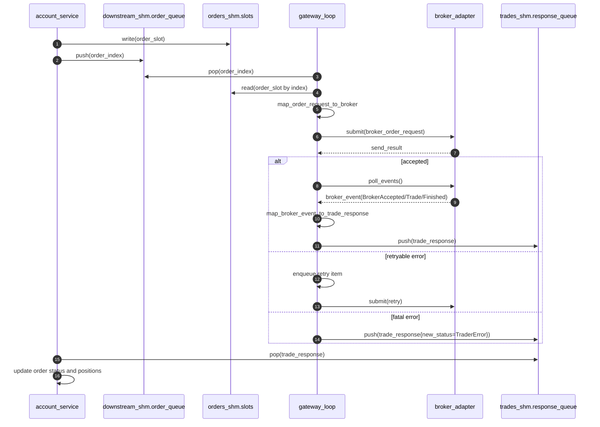

# Broker Gateway Design

## 目标

`acct_broker_gateway_main` 负责连接 `account_service` 与券商适配器：

1. 从 `downstream_shm_layout.order_queue` 消费 `order_index_t`。
2. 通过 `orders_shm_layout.slots[index]` 读取 `order_request` 快照。
3. 转换为 `broker_api::broker_order_request` 并发送。
4. 从适配器拉取 `broker_event`。
5. 转换为 `trade_response` 并写入 `trades_shm_layout.response_queue`。

## 目录结构

- `gateway/src/gateway_config.*`：运行参数解析
- `gateway/src/adapter_loader.*`：插件适配器动态加载
- `gateway/src/order_mapper.*`：订单请求映射
- `gateway/src/response_mapper.*`：事件回报映射
- `gateway/src/sim_broker_adapter.*`：MVP 模拟券商
- `gateway/src/sim_broker_plugin.cpp`：模拟插件导出符号
- `gateway/src/gateway_loop.*`：单线程事件循环
- `gateway/src/main.cpp`：进程入口

## 时序图

## 线程与循环模型

单线程循环按固定顺序执行：

1. 处理重试队列（到期项）
2. 批量处理新订单（`poll_batch_size`）
3. 批量拉取适配器事件并回写成交回报
4. 空闲时 `idle_sleep_us`

统计信息按 `stats_interval_ms` 周期输出。

## 重试策略

- 适配器返回 `retryable=true` 时进入重试队列。
- 每次重试间隔 `retry_interval_us`。
- 超过 `max_retry_attempts` 后回写 `TraderError`。

## 状态映射

详见 `docs/broker_api_contract.md`。网关使用关键状态映射，保持与 `account_service` 现有状态机兼容。

## 配置项

启动参数仅支持：

- `--config`（YAML 配置文件路径，例如 `config/gateway.yaml`）
- `-h` / `--help`

业务参数统一放在 `gateway.yaml` 中，包含：

- `account_id`
- `downstream_shm`
- `trades_shm`
- `orders_shm`
- `trading_day`
- `broker_type`（`sim` 或 `plugin`）
- `adapter_so`（`plugin` 模式必填）
- `create_if_not_exist`
- `poll_batch_size`
- `idle_sleep_us`
- `stats_interval_ms`
- `max_retries`
- `retry_interval_us`

若不传 `--config`，默认读取 `config/gateway.yaml`。

## 适配器加载模式

- `sim`：使用内置模拟适配器。
- `plugin`：通过 `dlopen` 加载配置文件 `adapter_so` 指定的插件。

插件需导出 3 个 C 符号（见 `broker_api.hpp`）：

- `acct_broker_plugin_abi_version`
- `acct_create_broker_adapter`
- `acct_destroy_broker_adapter`

## MVP 已知限制

- 当前仅实现 `sim` 适配器。
- `broker_event` 未包含 `exec_id/reject_reason` 等扩展字段。
- 插件 ABI 目前只做版本号检查，未做更细粒度能力协商。
