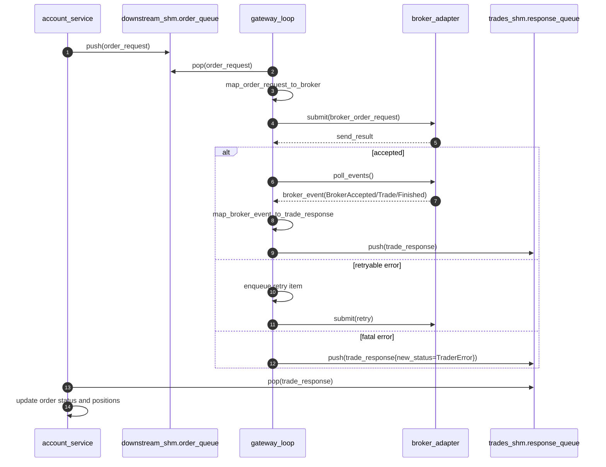

# Broker Gateway Design

## 目标

`acct_broker_gateway_main` 负责连接 `account_service` 与券商适配器：

1. 从 `downstream_shm_layout.order_queue` 消费 `order_request`。
2. 转换为 `broker_api::broker_order_request` 并发送。
3. 从适配器拉取 `broker_event`。
4. 转换为 `trade_response` 并写入 `trades_shm_layout.response_queue`。

## 目录结构

- `gateway/src/gateway_config.*`：运行参数解析
- `gateway/src/order_mapper.*`：订单请求映射
- `gateway/src/response_mapper.*`：事件回报映射
- `gateway/src/sim_broker_adapter.*`：MVP 模拟券商
- `gateway/src/gateway_loop.*`：单线程事件循环
- `gateway/src/main.cpp`：进程入口

## 时序图

## 线程与循环模型

单线程循环按固定顺序执行：

1. 处理重试队列（到期项）
2. 批量处理新订单（`poll_batch_size`）
3. 批量拉取适配器事件并回写成交回报
4. 空闲时 `idle_sleep_us`

统计信息按 `stats_interval_ms` 周期输出。

## 重试策略

- 适配器返回 `retryable=true` 时进入重试队列。
- 每次重试间隔 `retry_interval_us`。
- 超过 `max_retry_attempts` 后回写 `TraderError`。

## 状态映射

详见 `docs/broker_api_contract.md`。网关使用关键状态映射，保持与 `account_service` 现有状态机兼容。

## 配置项

支持命令行参数：

- `--account-id`
- `--downstream-shm`
- `--trades-shm`
- `--broker-type`（当前仅 `sim`）
- `--create-if-not-exist`
- `--poll-batch-size`
- `--idle-sleep-us`
- `--stats-interval-ms`
- `--max-retries`
- `--retry-interval-us`

## MVP 已知限制

- 当前仅实现 `sim` 适配器。
- `broker_event` 未包含 `exec_id/reject_reason` 等扩展字段。
- 采用编译期链接模式，未启用动态插件加载。

