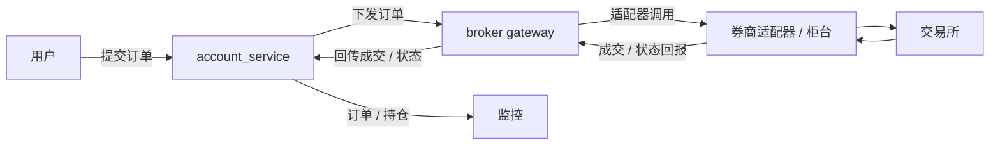
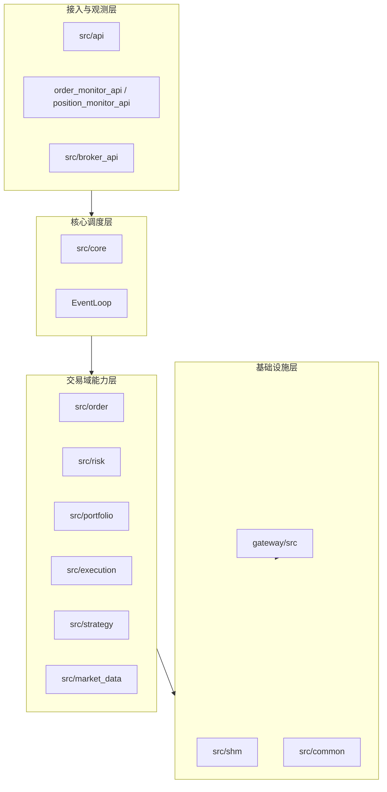
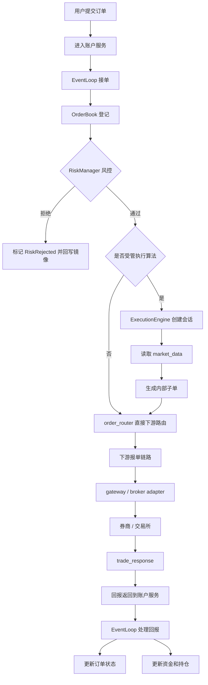

# Account Service 介绍

## 1. 系统是什么

> 这套系统是一套面向量化交易场景的账户服务系统，主要负责订单接入、风控检查、执行算法、下游报单、成交回报处理，以及账户资金和持仓维护。  
> 如果从整条交易链路去看，它的上游是用户、调用方；它的下游是券商、柜台和交易所；它的侧面还有我们自己的监控
> 也就是说，我们的系统夹在用户和券商通道中间，做用户指令的执行和状态管理，是整个交易链路中的中间枢纽。  
> 上游把订单送进来，我们执行算法、策略生成可执行的订单，再通过下游把订单发出去，回报再回来，最后由我们把订单状态、资金、持仓和监控视图统一收敛起来。




## 2. 开发目的

> 我们开发这个系统的目的就是为了能将我们开发出来的算法、策略提供给用户使用，通过使用我们的系统加上算法带给用户超额收益。同时并且还能做完备的风控。

## 3. 系统的内部架构

> 如果只从实现角度去看，这套系统内部可以分成四层。  
> 最上面一层是接入和观测层，也就是下单 API、订单监控和持仓监控这些接口。  
> 中间一层是核心调度层，主要是服务装配和事件循环。  
> 再往下是业务能力层，包括订单管理、风控、账户持仓、执行算法、主动策略和行情读取。  
> 最底下是基础设施层，也就是底层通信、日志、错误模型，以及 gateway 这一层对外适配能力。  



## 4. 一笔订单的实际流程

> 一笔订单从进来到结束，中间到底发生了什么。  
> 上游用户先把订单提交到系统。  
> 账户服务里的 `EventLoop` 读到这笔订单以后，会先把它登记到 `OrderBook`，然后进入 `RiskManager` 做风控。  
> 如果风控不过，这笔订单就在这里被拒绝了；如果风控通过，就继续往下走。  
> 如果它是普通订单，就直接交给 `order_router` 往下游发；如果它是受管执行算法订单，就交给 `ExecutionEngine`，由执行引擎结合行情和策略逐步释放子单。  
> 子单或者普通订单接下来都会进入下游报单链路，然后由 gateway 取走，映射成券商侧的请求。  
> 柜台或者市场返回的回报，会再回到账户服务。  
> 账户服务再把这些回报消费掉，用来更新订单状态、资金、持仓。  




### 4.1 下单演示

```sh
./tools/full_chain_e2e/demo_buy_twap.sh
./tools/full_chain_e2e/demo_sell_twap.sh
```

### 4.2 输出

- build/e2e_artifacts/.../output/orders_final.csv 实际发送的订单
- build/e2e_artifacts/.../output/positions_final.csv 最终的持仓
- build/e2e_artifacts/.../account_services.stdout.log 主进程运行日志
- build/e2e_artifacts/.../gateway.stdout.log gateway进程日志
- observer.stdout.log 监控进程日志
- logs/order_debug_1001_19700101.log 调试日志
- logs/order_events_1001_19700101.log 业务日志

字段解释：
- [field_reference.md](e2e_field_reference.md)

## 5. 关键模块

> 第一块是订单模块。这个模块负责订单簿、内部订单号、父子单关系、撤单路由，还有重启恢复。它更像整套系统的交易骨架。  
> 第二块是风控模块。这个模块负责资金检查、持仓检查、单笔限额、价格限制、重复单和速率限制。它的特点是规则链化，而不是把所有逻辑堆在一个大函数里。   
> 第三块是执行引擎。它专门负责 `TWAP` 这类算法执行指令，会在多轮 tick 里根据预算、在途子单和行情决定怎么继续发，管理的是一个指令会话。  
> 第四块是主动策略模块。行情模块提供盘口和 prediction 视图，主动策略模块就是在拆单窗口期内使用预测值判断是否下单、下多少量。


## 6. 为什么这么拆分模块
> 这套系统的重点不是单纯帮用户“把订单发出去”，而是把订单生命周期、账户状态、风控、执行算法和通道适配统一放进一个低延迟、可观测、可扩展的中间层里。

## 7. 下一步

> 1. 添加更多的算法种类，同时扩展相同算法的执行细节，因为同一个算法实际上根据不同的参数可以得到完全不同的执行效果。
> 2. 主动策略需要做更多的开发，这里需要与模型的预测值进行更细致的配合，怎么将模型的优势发挥的更好重点就是在策略里。因为已经提前考虑到了这一点，所以现在设计的系统也是一个易于扩展策略的架构。
> 3. 更低的延迟，优化未来在更高频场景下交易

## 8. QA

### 8.1 为什么用共享内存


> 因为这个场景更看重低延迟和本地高吞吐，订单入口、下游队列和回报回流都适合用共享内存来做。  
> 另外，共享内存不仅是通信介质，在这个系统里它还顺带承担了监控镜像和恢复状态来源的角色，所以一套机制做了三件事。

### 8.2 为什么要拆成 `account_service` 和 `gateway`

> 因为账户侧逻辑和券商适配逻辑本来就是两类问题。  
> 账户服务更关心订单状态、风控、持仓和执行算法；gateway 更关心订单映射、适配器加载和券商事件回报。  
> 拆开以后，两边的演进节奏和故障边界会更清晰。

### 8.3 普通订单和算法订单有什么区别

> 普通订单风控通过以后就直接往下游发。  
> 算法订单不会直接一次性下去，而是先进入执行引擎，由执行引擎根据算法配置和行情持续生成子单。  
> 所以普通订单更像直连路径，算法订单更像托管路径。

### 8.4 拆出来的子单会不会再过一遍风控

> 按当前实现，父单会先过一次风控。  
> 如果父单进入了受管执行引擎，后续执行引擎生成的 managed child 子单不会再单独走一遍 `RiskManager::check_order()`，而是直接进入内部下游提交流程。  
> 所以当前更像是“父单先风控，子单继承父单结果”的模式。

### 8.5 这套系统的核心卖点是什么

> 我会把它概括成四个词：低延迟、强状态、可扩展、可观测。  
> 低延迟来自底层通信机制和事件循环；强状态来自订单、资金和持仓的一体化维护；可扩展来自风控、执行算法和券商适配器的模块化边界；可观测来自订单和持仓状态本身就是可读镜像。

## 9. 参考

- [docs/order_flowchart.md](docs/order_flowchart.md)
- [docs/src_modules_overview.md](docs/src_modules_overview.md)
- [docs/src_core_module.md](docs/src_core_module.md)
- [docs/src_execution_module.md](docs/src_execution_module.md)
- [gateway/docs/gateway_design.md](gateway/docs/gateway_design.md)

这几份文档是对细节的补充
